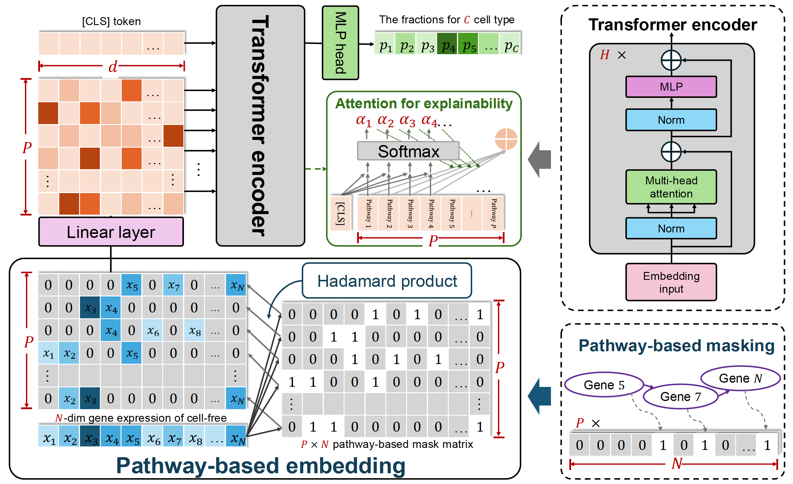

# Deconformer

preprint article : Pathway-enhanced Transformer-based robust model for quantifying cell types of origin of cell-free transcriptome

[DOI: 10.1101/2024.02.28.582494](https://doi.org/10.1101/2024.02.28.582494)

## Deconformer model structure


## Requirements

- **OS**: Linux/UNIX/Windows
- **Python Version**: >= 3.10.12
- **Library**:
  - torch >= 2.0.0
  - scanpy >= 1.9.3

## Repository Structure

* The root directory of this repository contains all the code for Deconformer.
* The `resource` subdirectory contains reference data required by Deconformer, as well as code for generating simulated data.
* The `model_weights` subdirectory contains pre-trained model files for Deconformer, including models for adults, fetals, and pregnancy stages.
* The `inference_results` subdirectory is where Deconformer saves its inference results. It also includes an example of a Deconformer inference output.
* The `example_input` subdirectory contains an example input file of a cfRNA expression matrix.
* The `gene_model` subdirectory contains the code for Deconformer-gene. This is a variant of Deconformer in which gene embeddings are used instead of pathway embeddings.
* The `Analysis` subdirectory contains downstream analysis and visualization code based on the inference results of Deconformer, as presented in the article.
* The `Dockerfile` subdirectory contains the files used for building the docker image.


## Usage

### Usage 1: use pre-trained the model to inference cfRNA samples via docker image (recommend)

To make Deconformer easier to use, we have packaged the model weights, dependencies, and inference scripts into a Docker image and published it on Docker Hub.

#### step1: Make sure you have Docker Engine or Docker Desktop installed

if not, follow the 
[installation guide](https://docs.docker.com/get-started/get-docker/) in the official documentation.

#### step2: Pull the Deconformer image from Docker Hub

```bash
docker pull 2303162150/deconformer
```

#### step3: Create container to start inference

Assuming you have a gene expression matrix in a tsv file `exp.tsv`, with rows as genes and columns as samples. When using Docker, a local directory needs to be synchronized with the container. The input expression matrix and the output prediction results should both be in this directory or its subdirectories. Run the following command to create a container and run the Deconformer inference script:

```bash
docker run --rm \
  -v $workdir:/workspace \
  2303162150/deconformer $model_name $exp_tsv $out_tsv
```
According to your actual situation, please replace the `$workdir` `$exp_tsv` `$out_tsv` `$model_name` in the command with a string:
* `$workdir` is the local synchronization working directory, and the paths for `$exp_tsv` and `$out_tsv` should be relative to this directory.
* `$exp_tsv` is the tsv file of the expression matrix.
* `$out_tsv` is the tsv file of inference result.
* `$model_name` is the name of the trained model. You can choose from the following three models:
  * [`adult_model`](resource/NBT_simu_cell_order_sccpm.txt) 60 basic cell types; 
  * [`fetal_model`](resource/fetal_simu_cell_order_1204.txt) 27 types of cells + 3 types of trophoblast cells + 4 types of fetal cells; 
  * [`preg_model`](resource/cell_types_for_preg_model.tsv) 60 types of cells + early and late stages of SCT, EVT, VCT, totaling six types of trophoblasts.

If your device supports CUDA, it uses the GPU for inference by default; otherwise, it uses the CPU for inference. Even if you use CPUs of laptop, you can infer about 200 cfRNA samples within 10 minutes.


### Usage 2: use pre-trained the model to inference cfRNA samples from source code
Inference of cfRNA samples using a pre-trained model does not require a GPU, and about 200 samples can be inferred in 10 minutes on a laptop without a dedicated GPU.

```python
python  deconformer_predict.py  saved_model_path  expression_profile 
```

#### Input:

- `expression_profile`: An expression profile of a cfRNA sample in `CSV` format, for which you need to infer the origin fractions, with rows as gene names and columns as sample names.
- `saved_model_path`: A path for saving pre-trained model parameters and mask matrices (for example, the adult model:  ./model_weights/adult_model/ ).

#### Output:
- `prefix_deconformer_re.txt`: A `txt` named with the prefix of your sample expression profile file followed by '_deconformer_re', where the rows are sample names and the columns are cell type names. It is saved by default in the ./inference_results/ directory.


### Usage 3: Train a model from scratch for custom target cell types
#### step 1: simulate cfRNA smaples
```python
python  deconformer_simulate.py
```
#### step 2: trainning deconformer model
 ```python
python  deconformer_train.py  ann_simulated_data  gmt_file  project_name
```
##### Input:
- `ann_simulated_data`: A `AnnData` object which saved the simulated cfRNA data
- `gmt_file`: A `gmt` file that contains pathway information. This study uses GSEA C5 GOBP pathway, and users may choose other pathway data.
- `project_name`:  Users customize a ` project name`, and the model parameters and mask matrix trained subsequently will automatically be saved in a folder named after this project.
##### Output:
- `model_checkpoint_epoch_n.pt`: A `pt` file that saves the model parameters of the nth epoch.
- `mask_gene_n_pathway_m.txt`: A mask matrix created from the given `gmt` file, where `n` is the number of pathways and `m` is the number of genes.

#### step 3: Infer cfRNA samples, usage as in usage 1.
